# Podcast bearbeiten mit Ultraschall 5

Auch wenn es um Ultraschall geht, fällt hier oft der Name "Reaper". Denn Reaper ist eine Software, die durch das Projekt "Ultraschall" erweitert wird. Einfachheitshalber spreche ich hier von Ultraschall, meine jedoch immer die Kombination "Reaper/Ultraschall“.

## Reaper und Ultraschall installieren

Um die Software zu installieren gehen wir auf die Webadresse [https://ultraschall.fm/install](https://ultraschall.fm/install/). Dort sind alle Informationen vorhanden, die wir für die Installation benötigen. Grundsätzlich werden Windows und macOS unterstützt.

Die Installation ist gut beschrieben, man muss einfach die Schritte auf der Seite befolgen.

Wichtig: Es werden die Administrator-Rechte auf dem PC benötigt.

## Ultraschall starten und den Schlüssel eingeben

Nach dem ersten Start wird ein Dialog angezeigt, was alles in der akuellen Version von Ultraschall neu ist. Wir können den Hacken wegnehmen, dass beim nächsten Start das Fenster wieder kommt.

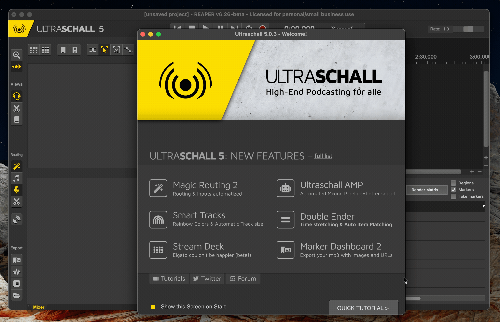

Die Software Reaper kostet Geld: Man muss [eine Lizenz kaufen](http://reaper.fm/purchase.php). Wenn diese gekauft wurde, erhält man eine E-Mail mit den Lizenzdaten. Wenn man diese in den Zwischenspeicher kopiert, erkennt Reaper/Ultraschall dies beim Start und fragt, ob die Lizenz importiert werden soll. Sollte Reaper das nicht fragen, kann man einfach auf "Import License key..." klicken.

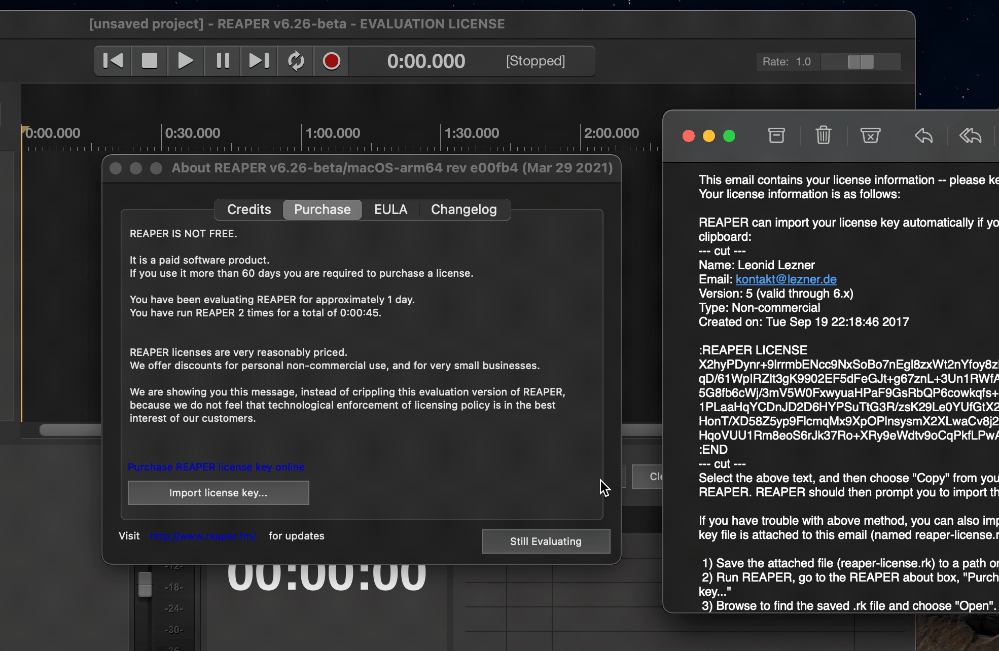

## Audio-Device auswählen

Wenn man mit Ultraschall arbeitet, bearbeitet man in den meisten Fällen Audioinformationen und muss dafür die passende Schnittstelle vom PC/Mac auswählen. Die geschieht in dem Menüpunkt "Podcast > Audio device settings...". Sollte eine Schnittstelle nicht aufgelistet sein, sollte man das Fenster schließen, die Schnittstelle überprüfen und dann das Fenster erneut öffnen.

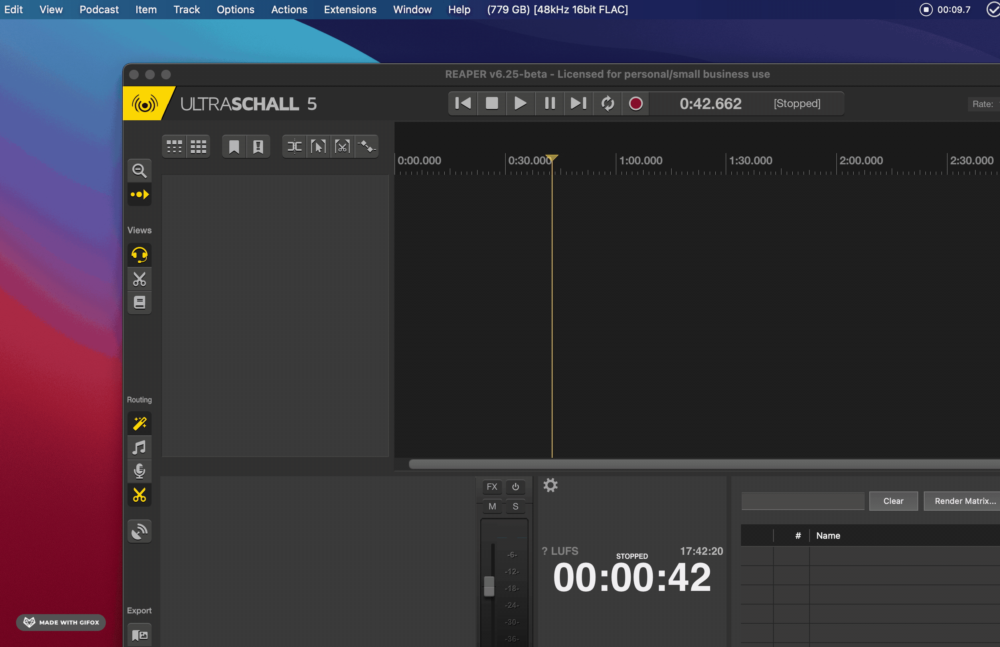

## Projekt speichern

Wenn ich mit einem neuen Projekt starte, speicher ich es zuallererst. Dadurch wird für alle Dateien des Projektes ein neuer Ordner erstellt. Dass das Projekt noch nicht gespeichert ist, erkennt man an dem Titel "unsaved project".

Ein gespeichertes Projekt ist nun komplett in einem Ordner untergebracht. Alle Audiodateien, die man für das Projekt nutzt, sollte man ebenfalls in diesen Ordner kopieren.

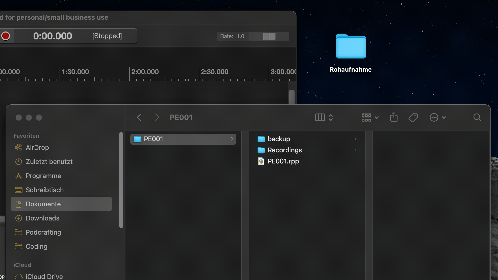

## Rohdateien einfügen

Da die Rohdateien nun mit dem Projekt zusammen liegen, können wir sie ins Projekt importieren. Die einfachste Art sie per Drag&Drop ins Projekt zu ziehen. Man wird gefragt, ob die Dateien als separate Tracks oder ein einzelner Track importiert werden sollen. In den meisten Fällen ist die Option "Separate Tracks" die sinnvolle.

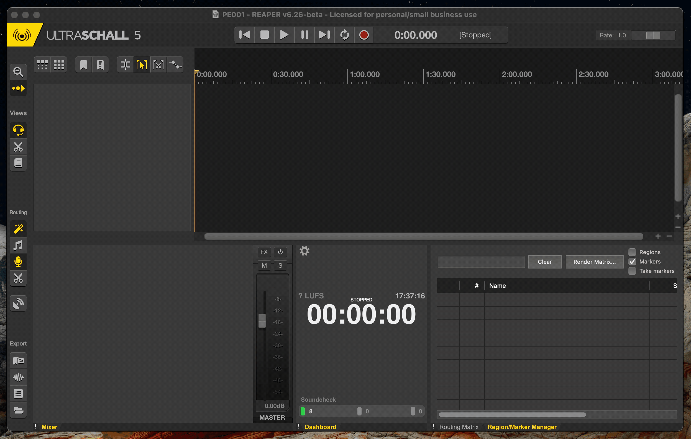

## Tracks löschen und umbenennen

Je nachdem womit der Podcast aufgenommen wurde, könnte die Rohaufnahme mehr Dateien enthalten, als tatsächlich benötigt. Manchmal nehmen die Rekorder nicht nur die einzelnen Sprecher:innen auf, sondern auch eine Stereospur, die alles zusammengemsicht enthält. Für die Bearbeitung des Podcasts können wir diese Spuren löschen. Dafür wählt man die Spur auf der linken Seite aus und löscht sie mit der Taste "Entf" auf der Tastatur.

Es empfiehlt sich die Spuren gleich richtig zu benennen.

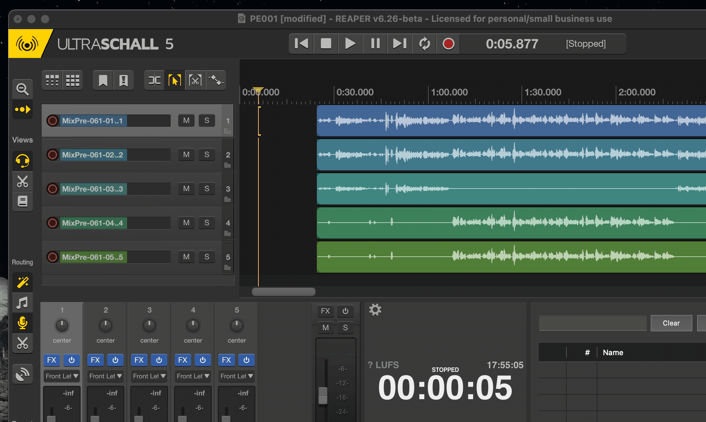

## Aufnahmen verschieben und schneiden

Man kann die einzelnen Elemente in den Spuren frei verschieben. Je nachdem ob mal alles zusammen oder in Teilen verschieben möchte, gibt es verschiedene Einstellungen in Ultraschall.

Für die nächsten Schritte ist die im folgenden Bild dargestellte Werkzeugleiste wichtig. Sie befindet sich im linken oberen Teil der Oberfläche von Ultraschall.

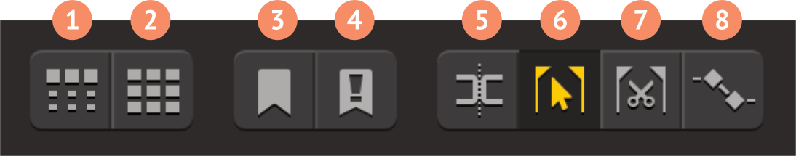

### Zeitselektion deaktivieren

Normalerweise startet Ultraschall mit der voreingestellten Zeitauswahl (**Button 6** ist aktiv). Dadurch kann man die Tracks nicht verschieben, sondern nur eine Zeitselektion vornehmen.

Wenn man die Tracks verschieben möchte, muss man den **Button 6** durch einen Klick deaktivieren.

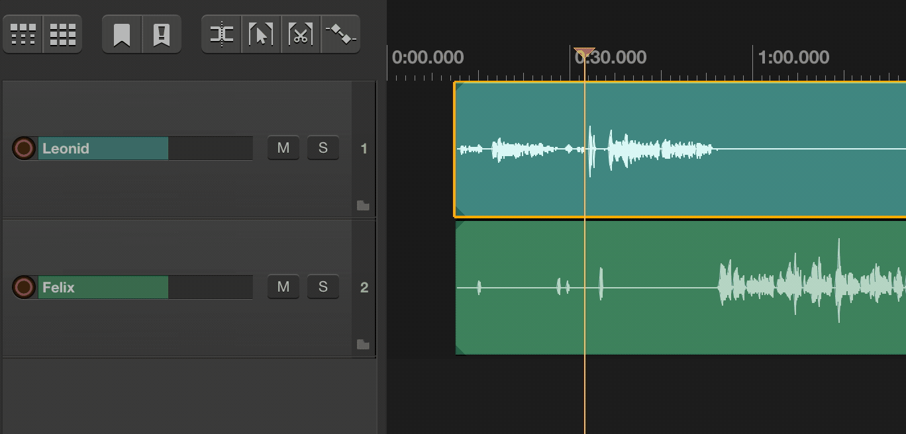

### Aufnahmen schneiden

Wenn man die Aufnahme schneiden möchte, sollte man normalerweise in allen Tracks gleichzeitig vornehmen. Dafür stellt man den Zeitcursor an die gewünschte Position und drückt den **Button 5** oder die Tasten "S" auf der Tastatur. Ist eine oder mehrere Spuren ausgewählt, werden nur sie geschnitten. Möchte man alle Spuren schneiden, so sollte man die Selektion (gelbe Umrandung der Spur) deaktivieren.

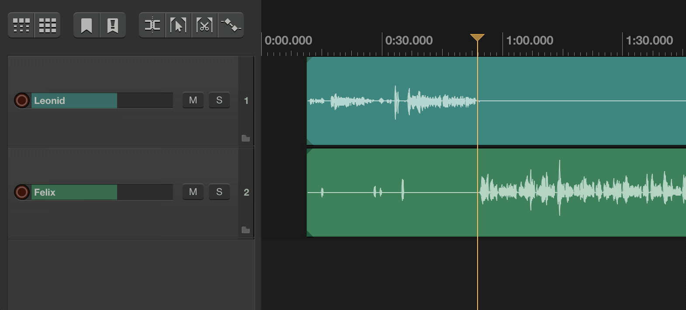

### Verschieben der Elemente

Es gibt mehrere Modi, in denen die Teile der Spuren verschoben werden können. Je nach Aufgabe können sie alle sinnvoll sein, daher sollte man sie alle beherrschen.

Wenn die **Buttons 1** und **2** deaktiviert sind, kann man alle Elemente separat verschieben.

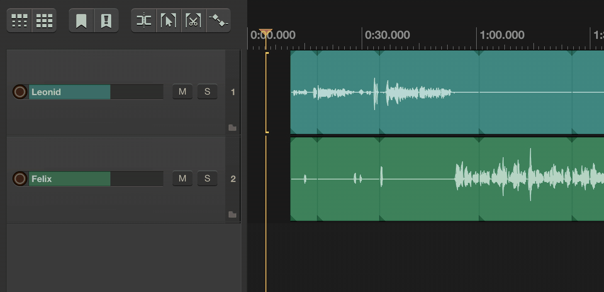

Wenn der **Button 1** aktiv ist, dann werden die Elemente rechts von dem ausgewählten Element in einer Spur zusammengehalten.

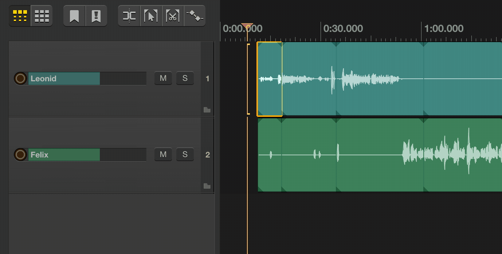

Wenn der **Button 2** aktiv ist, dann werden die Elemente rechts von dem ausgewählten Element in allen Spuren zusammengehalten.

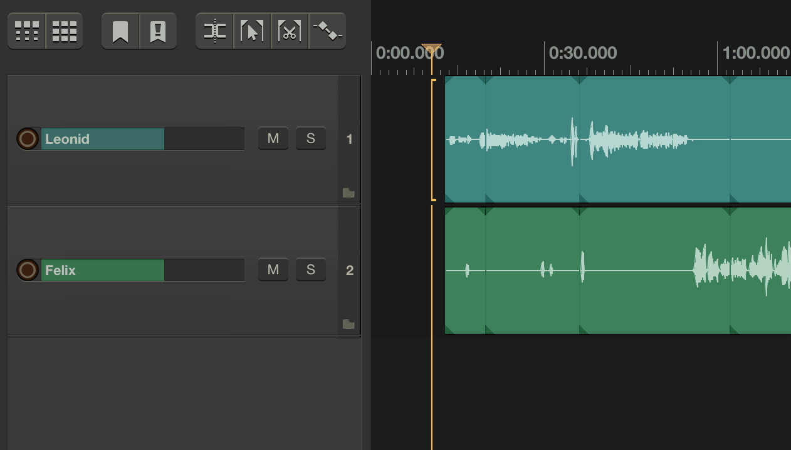

## Auswahl muten/unmuten

Wenn man einzelne Teile der Aufnahme stummschalten möchte (muten), sollte man die Zeitselektion wieder aktivieren (**Button 6**). Dann selektiert man die gewünschte Spur und wählt den gewünschten Bereich aus. Mit der Tastenkombination "Cmd+Y" (Mac) bzw. "Strg+Y" (Windows) wird dann die Auswahl stummgeschaltet. Es wird in Ultraschall eine zusätzliche "Mute-Spur" eingeblendet, die die Stummschaltung steuert. Ist diese Spur auf den Pegel 0 gesetzt, ist die ursprüngliche Aufnahme nur stummgeschaltet, sie bleibt somit vollständig intakt.

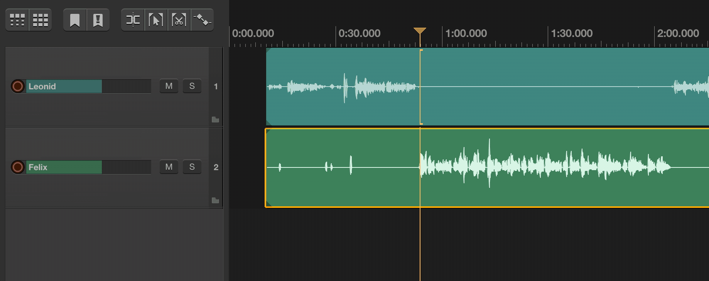

Möchte man die Auswahl wieder einschalten, also die Stummschaltung aufheben (unmuten), kann man das mit der Tastenkombination "Shift+Cmd+Y" (Mac) bzw. "Shift+Strg+Y" (Windows) vornehmen.

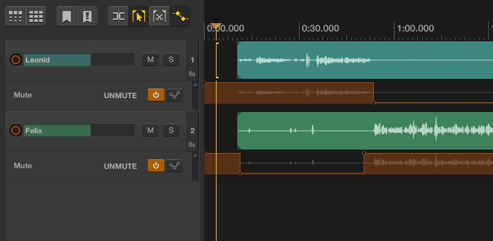

## Aufnahmen am Anfang/Ende trimmen

Bewegt man den Mauscursor an den Rand eines Elements, bekommt man ein Werkzeug, mit dem Man das Element in der Spur am Anfang oder Ende schneiden kann.

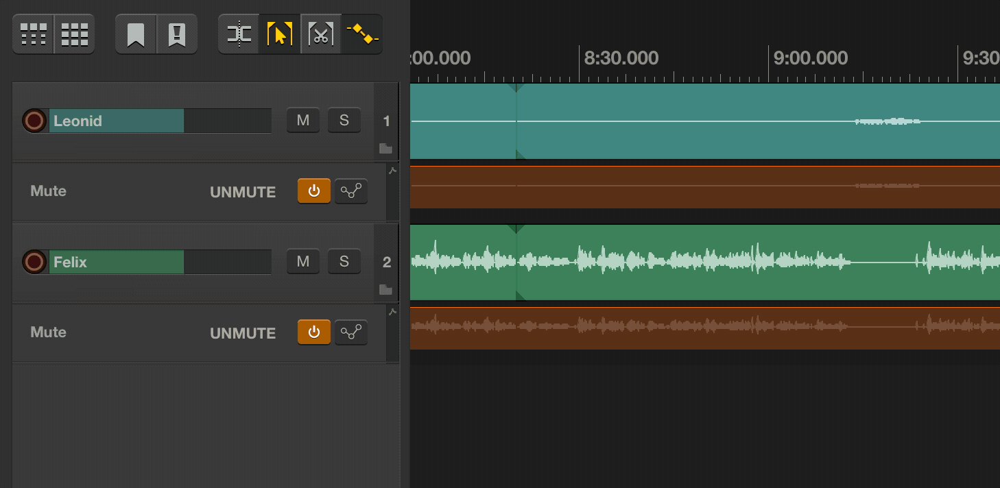

## Fade-in und Fade-out in Aufnahmen

Soll die Aufnahme bzw. ein Element nicht so abrupt starten oder enden, kann man die Lautstärke sanfter ansteigen oder abklingen lassen (Fade-in/Fade-out). Das Werkzeug sieht ähnlich aus wie beim Trimmen des Elementes, nur greift man etwas weiter oben.

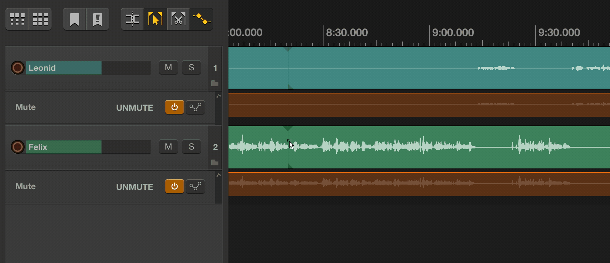

## Cross-Fade

Bewegt man ein Element der Spur so weit, dass es mit einem anderen Element überlappt, wird automatisch ein Cross-Fade vorgenommen: Ein sanfter Übergang von einem Element ins nächste. Sinnvoll z.B. wenn man Musik in Podcasts benutzt und sie in die Sprachaufnahme einblenden möchte.

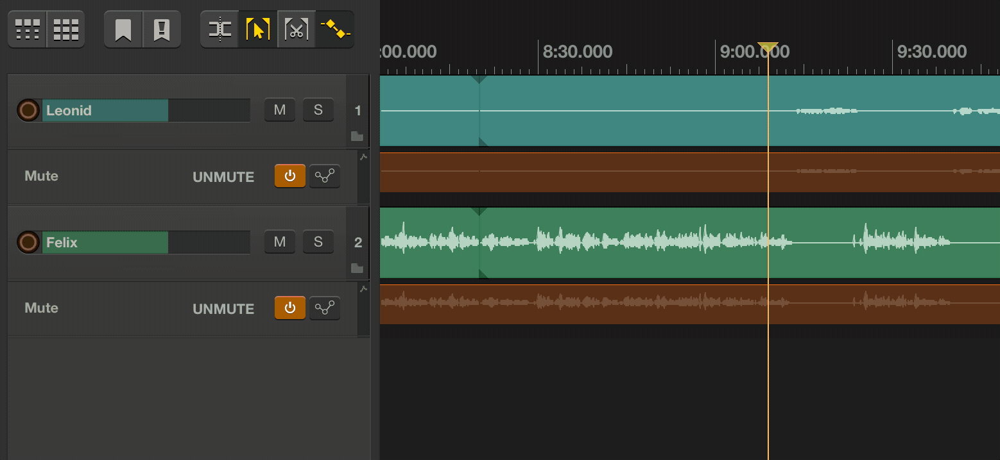

## Filter einstellen (pro Track und Master)

Ultraschall hat einige fingebaute Filter, die uns jede Menge Arbeit abnehmen. Dazu zählt Ultraschall Dynamics: Rauschreduzierung und Pegelanhebung einzelner Spuren.

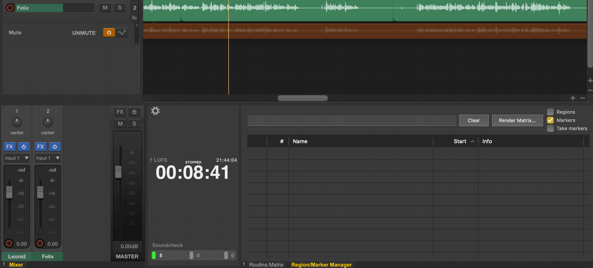

Um den Pegel der gesamten Aufnahmen auf einen Standardwert zu heben, gibt es noch einen Filter, den man aktivieren muss: LUFS Loudness Metering.

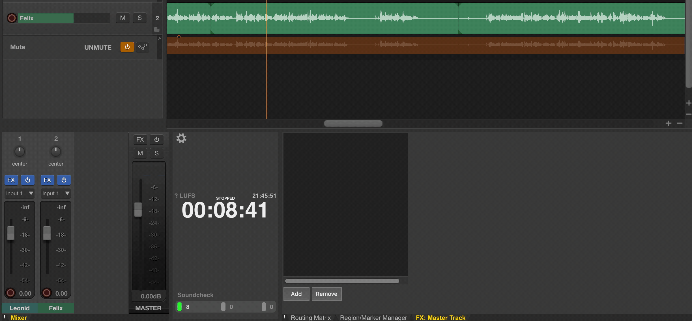

---

Bald kommen weitere Kapitel!

## Kapitelmarken setzen

## Projekt als MP3 exportieren

## Cover und ID3 Tags setzen

## Metadaten in die Datei schreiben

# Weitere Informationen und Downloads

* Download: [Schnellübersicht der Oberfläche](https://github.com/leonidlezner/ultraschall-tutorial/raw/main/docs/downloads/Quick-Info-Ultraschall.pdf)